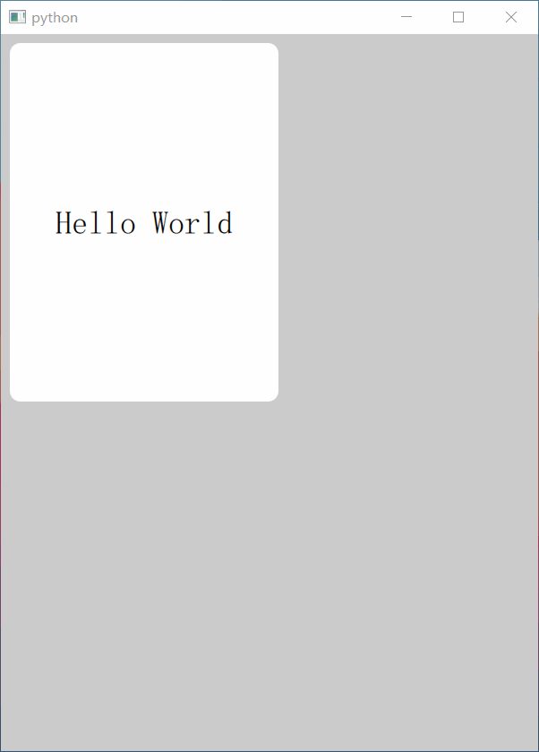

> 📝 English documentation is on the way. See Chinese version below.

# Declare QtQuick | 声明式 QtQuick 界面库

以全新的方式编写 QtQuick (QML) 界面.

`declare-qtquick` 支持开发者以纯 Python 语法 + 声明式语法结构编写现代化的界面程序. 它看起来长这样:

```python
from declare_qtquick import Application
from declare_qtquick.widgets import *
from lk_lambdex import lambdex  # pip install lk-lambdex

with Application() as app:

    with Window() as win:
        win.width = 300
        win.height = 400
        win.color = '#F9F0F5'
        win.visible = True
        
        with Rectangle() as rect:
            rect.x = 10
            rect.y = 10
            rect.width = 200
            rect.height = 270
            
            rect.color = 'white'
            rect.radius = 8
    
            rect.width.set_anim(duration=1000)
            rect.height.set_anim(duration=1000)
            
            with Text() as txt:
                txt.anchors.center_in = rect
                txt.text = 'Hello World'
                txt.font.pixel_size = 24
                
            with MouseArea() as area:
                area.anchors.fill = rect
                area.clicked.connect(lambdex('', """
                    rect.width = win.width - 20
                    rect.height = win.height - 20
                """))

    app.start()
```

运行截图:

_FIXME: 下图是示意图, 实际代码仍在开发中._



它等同于以下 QML 代码:

```qml
import QtQuick
import QtQuick.Window

Window {
    id: win
    width: 300
    height: 400
    color: '#F9F0F5'
    visible: true
    
    Rectangle {
        id: rect
        x: 10
        y: 10
        width: 200
        height: 270
        
        color: 'white'
        radius: 8
        
        Behavior on width {
            NumberAnimation {
                duration: 1000
            }
        }
        
        Behavior on height {
            NumberAnimation {
                duration: 1000
            }
        }
        
        Text {
            id: txt
            anchors.centerIn: rect
            text: 'Hello World'
            font.pixelSize: 24
        }
        
        MouseArea {
            id: area
            anchors.fill: rect
            onClicked: {
                rect.width = win.width - 20
                rect.height = win.height - 20
            }
        }
    }
}
```

_TODO:More..._
